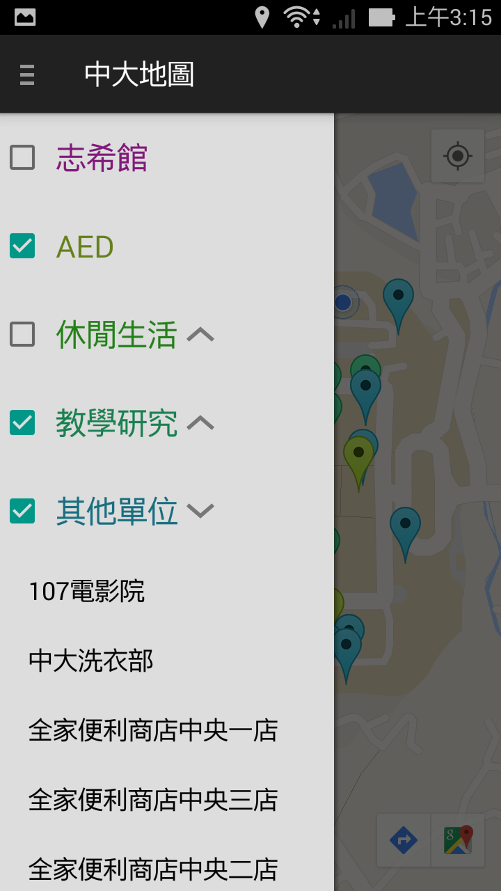
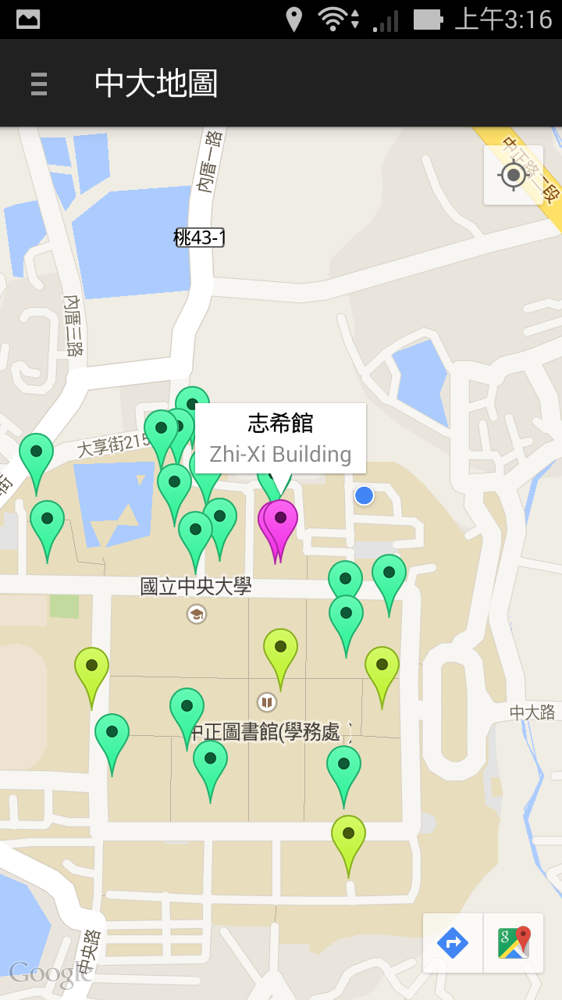
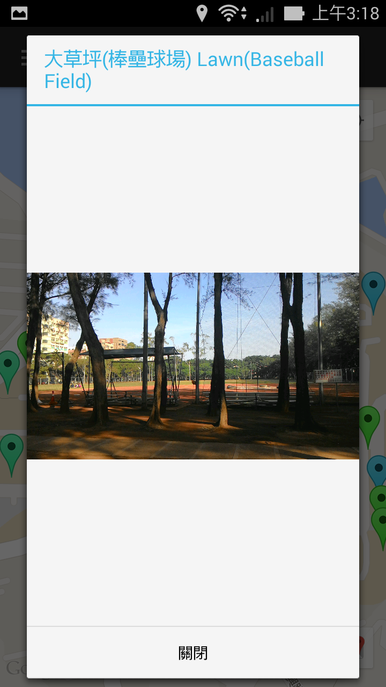

# 中大地圖 - 使用教學

###入口頁面

這是中大地圖的入口頁面，自上而下分別為：

  - 搜尋欄：用於搜尋人名及單位名稱。
  - 分類按鈕：點選直接進入該分類地圖，長按為多選。
  - 緊急聯絡電話

> 搜尋欄可與分類按鈕同時使用

###地圖 - 側邊欄

  - 每個選項為先前之搜尋內容及所選分類
  - 點擊左側選取框可變更該分類是否顯示於地圖中。
  - 右側有箭頭者，表示該分類有細項，點擊箭頭可展開或收起細項。
  - 點擊細項將自動移動至該標記

###地圖

  - 點選標記可顯示該標記之名稱
  - 右上角之按鈕可移動地圖至現在位置
  - 右下角兩個按鈕由左至右分別是以Google地圖導航及在Google地圖中開啟

###地圖 - 內容

  - 點選特定標記名稱可顯示內容
  - 休閒生活分類會顯示照片
  - 行政服務及教學研究分類會顯示單位列表
